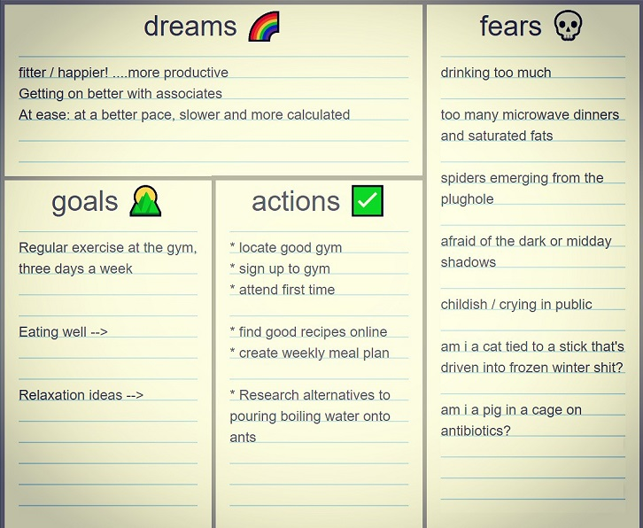

# dgaf - dreams-goals-actions-fears

This is a simple tool i've used for over 25 years, whenever i find myself fully and absolutely blocked on a task 🧱.

## [**try it online** &rarr;](https://dgaf.secretgeek.net)

Until now I would always recreate this on paper 📝 anytime I needed it.

This version is an "offline-first" standalone webpage you can download locally. 

There are four boxes where you dump your thoughts:

* Dreams 🌈
* Goals 🌄
* Actions ✅
* Fears 💀

You can enter things in any order, as they occur to you.

**Dreams** 🌈 is where you write a top-level, wildly impractical vision of what you hope to achieve. It is about picturing a successfull end state.

**Goals** 🌄 are more targeted, realistic than "dreams" - they might even fit the famous smart model and be "specific, measurable, achievable, realistic, time-focused"

**Actions** ✅ are the steps, the "next-actions" (in [GTD]()-speak) that will help you progress toward your goals.

While dumping down the points above you might find your mind gives you a steady stream of problems and negative ideas. Those are written in the **Fears** 💀 column... any bugs, issues, blockers, problems, crises, terrors, worries, tricky questions, obstacles... all the bad things. Get them out of your head and onto the paper.

The first three boxes are just for show: it's in the **Fears** 💀 area that you uncover what's stopping you from making progress.

## Long and illustrious history

- I started using this around 1995, inspired by a conversation about "stuckness", related to ideas from "Zen and the art of motorcycle maintenance"
- I first put a version online around 2002 -- <https://wiki.c2.com/?ListYourWayOutOfStuckness>
- And blogged about it in June 2004 -- <https://secretgeek.net/procrastless>
- It reached its peaked of cool when Merlin Mann's "43 Folders" blogged about it in October 2004 -- <https://www.43folders.com/2004/10/24/fast-way-to-get-unstuck>
- And I blogged on it again in Nov 2004. https://secretgeek.net/stuckness_delicious
- Looks like I made this subdomain'd version around 2019
- And I've added dark mode in around 2023.
